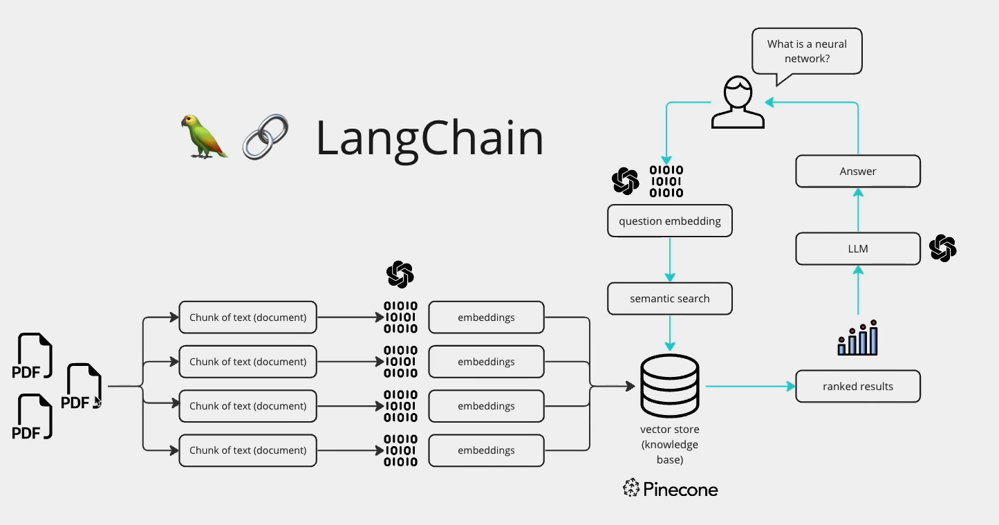

# MultiPDF Chat App

The MultiPDF Chat App is a Python application designed for conversing with multiple PDF documents simultaneously. By leveraging natural language processing, users can inquire about the contents of the PDFs and receive relevant responses. It utilizes a language model to ensure accuracy in answering queries, restricting responses to information within the loaded PDFs.


## Project Workflow


## The application follows these steps to provide responses to your questions:

1. PDF Loading: The app reads multiple PDF documents and extracts their text content.

2. Text Chunking: The extracted text is divided into smaller chunks that can be processed effectively.

3. Language Model: The application utilizes a language model to generate vector representations (embeddings) of the text chunks.

4. Similarity Matching: When you ask a question, the app compares it with the text chunks and identifies the most semantically similar ones.

5. Response Generation: The selected chunks are passed to the language model, which generates a response based on the relevant content of the PDFs.

## Dependencies and Installation

To install the MultiPDF Chat App, follow these steps:

1. Clone the repository to your local machine.
2. Install the necessary dependencies by executing the following command:
   ```bash
   - pip install -r requirements.txt
4. Obtain an API key from OpenAI and add it to the .env file in the project directory.
   ```bash
   - OPENAI_API_KEY=your_secrit_api_key
